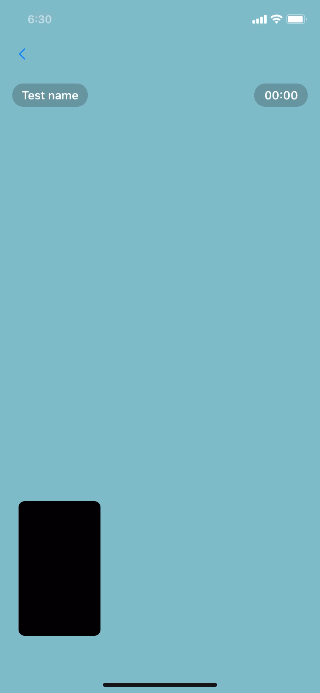

# VideoCallUI

A customizable, easy-to-use iOS library to create video call interfaces in your Swift applications.

<div align="center">
    
</div>

VideoCallController is a UIViewController subclass that provides a user interface for video calling, designed to be easy to open in full-screen or as a call screen with minimised mode. The controller has a variety of delegate methods for video call events and customisable UI elements.

# Features

- Fullscreen and minimised call UI modes.
- Positioning of the minimised call UI.
- Switching between local and remote video views.
- A collection of handy delegate methods for various call events.
- Animated, hideable call action buttons.
- Customisable button actions.
- Drag to reposition in minimised mode.

# Requirements

iOS 13.0+
Swift 5.1+
UIKit

# Installation

VideoCallController is available through Swift Package Manager. 
To install it into your project:

1. In Xcode, select "File" -> "Swift Packages" -> "Add Package Dependency"
2. In the search bar, enter the following URL: https://github.com/iamazhar/VideoCallUI
3. Click "Next", then select the version you want (usually the project defaults to the latest version).
4. Click "Next" again to confirm, then click "Finish" to add the VideoCallController package to your project.
5. After successful installation, import VideoCallController to your file as shown below:

```swift
import VideoCallUI
```

# Usage

After installing the library, import it wherever you want to use it:

```swift
import VideoCallUI
```

Instantiate the VideoCallController and present it:

```swift
let videoCallController = VideoCallController()
present(videoCallController, animated: true, completion: nil)
```

Implement VideoCallControllerDelegate to handle call events:

```swift
extension YourViewController: VideoCallControllerDelegate {
    func didTapBack(videoCallController: VideoCallController) {
        // Handle back button tap
    }
    
    func didTapMainView(videoCallController: VideoCallController) {
        // Handle main view tap
    }
    
    func didTapEndCall(videoCallController: VideoCallController) {
        // Handle end call
    }
    
    func didTapFloatingCallView(videoCallController: VideoCallController) {
        // Handle floating call view tap
    }
    
    func didTapCameraSwitchButton(videoCallController: VideoCallController) {
        // Handle camera switch
    }
    
    func didTapCameraButton(videoCallController: VideoCallController) {
        // Handle camera button tap
    }
    
    func didTapMicButton(videoCallController: VideoCallController) {
        // Handle mic button tap
    }
}
```
And set the controller's delegate:

```swift
videoCallController.delegate = self
```

For more usage examples, please see the Example folder.

# License

VideoCallController is released under the MIT license. See [LICENSE](LICENSE) for details.

# Contribute

We would love for you to contribute to VideoCallController, check the "Contributing" section and send us your pull request.

# Let us know

We’d be really happy if you sent us links to your projects where you use our component. Just send an email to azharcodes[at]gmail.com and do let us know if you have any questions or suggestion.
